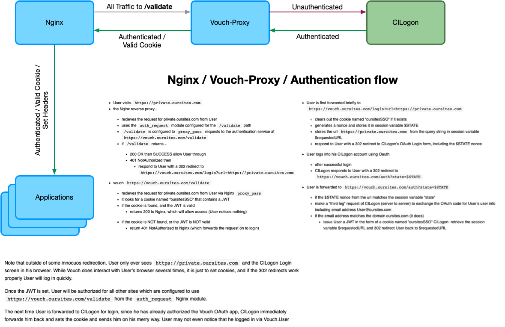
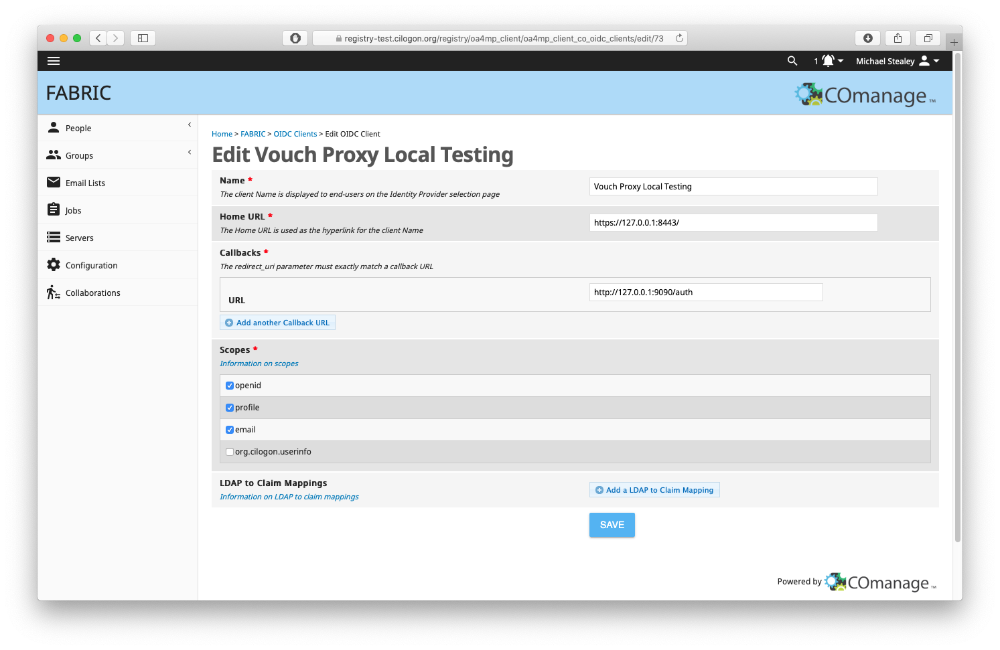
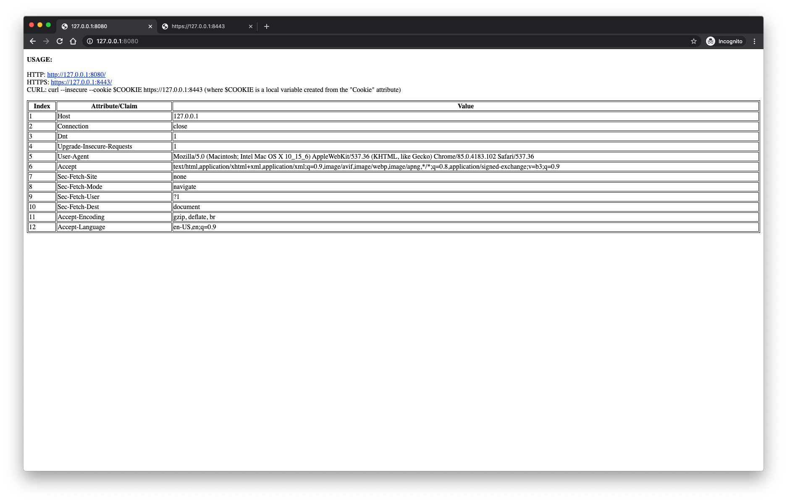
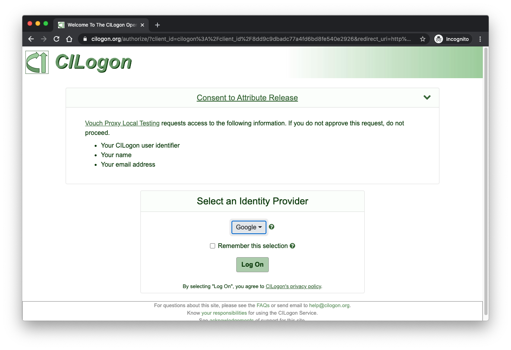

# CILogon / Vouch-Proxy Example

This example is designed to demonstrate how to use Vouch-Proxy (with Nginx) to enable authentication using [CILogon's OpenID Connect (OIDC) service](https://www.cilogon.org/oidc) for gaining access to a generic web application.





This project is comprised of a simple Python-Flask based application using Nginx as the web server to steer traffic to single URL endpoint demonstrating differing behavior depending on the port being used for access.

- **8080**: non-authenticated traffic over http
- **8443**: authenticated traffic over https

Traffic going over port 8080 isn't checked for authentication and is simply allowed to pass onto the Application.

Traffic going over port 8443 is first validated for authentication using Vouch-Proxy, and if validation fails the user is redirected to CILogon to authenticate before being sent back to the Flask application. Traffic on this port will be augmented with a number of header entries prior to being sent to the Application.

The Flask application displays the header information found in the user's request object. For non-authenticated traffic this is pretty vanilla, for authenticated traffic a number of CILogon attributes (or Claims) have been embedded in the header and displayed back to the user.

This example also demonstrates how to use the generated "Cookie" to make authenticated `curl` calls against the same Flask application.

**NOTES**: 

- A self-signed SSL certificate has been included for demonstration purposes and should not be used in any kind of production environment.
- The Flask application is using the default development server (on port 5000) which is sufficient for this demonstration, but should not be used in production.

## About

CILogon enables researchers to log on to cyberinfrastructure (CI). CILogon provides an integrated open source identity and access management platform for research collaborations, combining federated identity management (Shibboleth, InCommon) with collaborative organization management (COmanage). Federated identity management enables researchers to use their home organization identities to access research applications, rather than requiring yet another username and password to log on.

Vouch Proxy is an SSO solution for Nginx using the [auth_request](http://nginx.org/en/docs/http/ngx_http_auth_request_module.html) module that relies on the ability to share a cookie between the Vouch Proxy server and the application it's protecting.

### CILogon scopes

CILogon supports a variety of scopes. This example makes use of the following:

- **openid**: required
    - resulting claims: 
        - **sub** - a unique identifier for the user, e.g., "`http://cilogon.org/serverA/users/12345`"
        - **iss** - the issuer of the id_token, e.g., "`https://cilogon.org`"
        - **aud** - the audience of the id_token, which is the client_id of the OIDC client, e.g., "`cilogon:/client_id/123456789`"
        - **token_id** - an identifier for the returned id_token, e.g., "`https://cilogon.org/oauth2/idToken/abcdef123456`"
- **email**: optional
    - potential resulting claim: 
        - **email** - an email address, e.g., "`johnsmith@example.edu`"
- **profile**: optional
    - potential resulting claims: 
        - **given_name** - first name, e.g., "`John`"
        - **family_name** - last name, e.g.,  "`Smith`"
        - **name** - display/full name, e.g., "`John A Smith`"

## Usage

### Configuration

**Client Registration** 

- To get started, register your client at [https://cilogon.org/oauth2/register](https://cilogon.org/oauth2/register) and wait for notice of approval. Please register your callback URLs on that page with care. They are the only callback URLs that may be used by your client unless you later contact help@cilogon.org and request a change to your registration.
- Upon completion the user will be issued a `CILOGON_CLIENT_ID` and `CILOGON_CLIENT_SECRET` to be used in the `vouch/config` file.

```yaml
...
oauth:
  # Generic OpenID Connect
  # including okta
  provider: oidc
  client_id: CILOGON_CLIENT_ID
  client_secret: CILOGON_CLIENT_SECRET
  auth_url: https://cilogon.org/authorize
  token_url: https://cilogon.org/oauth2/token
  user_info_url: https://cilogon.org/oauth2/userinfo
  scopes:
    - openid
    - email
    - profile
  callback_url: http://127.0.0.1:9090/auth
```

For this example a client was created using the COmanage registry.



### Running

A `docker-compose.yml` file has been included to make running everything on your localhost simple. If you plan to deploy on a machine with a proper domain, you'll need to adjust the configuration files accordingly.

```console
$ docker-compose pull
Pulling vouch-proxy ... done
Pulling app         ... done
Pulling nginx       ... done
$ docker-compose build
vouch-proxy uses an image, skipping
nginx uses an image, skipping
Building app
Step 1/9 : FROM python:3
...
Successfully built 9c7c5a5e3e07
Successfully tagged cilogon-vouch-proxy-example_app:latest
$ docker-compose up -d
Creating network "cilogon-vouch-proxy-example_default" with the default driver
Creating ex-vouch ... done
Creating ex-app   ... done
Creating ex-nginx ... done
```

Check to make sure all containers are running as expected

```console
$ docker-compose ps
  Name                Command                  State                          Ports
------------------------------------------------------------------------------------------------------
ex-app     /docker-entrypoint.sh run_ ...   Up             0.0.0.0:5000->5000/tcp
ex-nginx   /docker-entrypoint.sh ngin ...   Up             0.0.0.0:8443->443/tcp, 0.0.0.0:8080->80/tcp
ex-vouch   /vouch-proxy                     Up (healthy)   0.0.0.0:9090->9090/tcp
```

With all containers running as expected, navigate to [http://127.0.0.1:8080/](http://127.0.0.1:8080/) and denote the basic header infomation



Next, follow the link to the secure example of the same page at [https://127.0.0.1:8443/](https://127.0.0.1:8443/)

You'll be asked to authenticate using CILogon



And upon authentication you will be redirected to the secure version of the page.


Note all of the additional header information being injected by Vouch-Proxy via Nginx.

The Cookie information can also be used to interact with the same page via the `curl` command

```console
$ COOKIE='cilogon-example=H4sIAAAAAAAA_2yQ0XKjIBiFn2g7EWNXL9sYlVRxTRSEO4G0omicptHI0--wu-3e9I7hn_PNd855PbQ8FipXB1gZ6CAFr3A8emIHH2E_1Xh3CB7O68ERAK98iD7YCT7CEW0Yia6s1k-SeF064F6ebBBNMsYGdhOvT4sqXGxkHHwU4N42xLH_P-EQOczCBzTxOBg52D6mAF0bgm8yCia287csLjxqdE-HqKdGuLQ8DixkioXtwMpqk8XVmpcQQLUoRpy2IYstYGSMWx5jr0jwja6eZkml0t1hoMSZeKJfv_z1p39v72NTM811cKPE0bC7qJLorokjzXfwCgdtxGp9241Mnk2u_JkCfeVAzlx5sxiEZXyTfS4_fayncLGy9yY5bkR4mVPw1f_G3cOYukiLkWnR72dZ23c2Z12xZuXb3eZlHLwz4r02pLBdLzI5LsJ8wwFBK-vjJVPBxKLj3AB8Sw10GaEmA9nCujeHmlZRkrkUoDYzcIO6YkXlm8nCDKRm7-Rl7-YhdFHYGxRC9XpaVLWPOgqwEc5fpu1ivaq97vEft63KFbRb6HPypPLuH6cUdxT2_3fUbJYEXeC4edjmzH0vXpI6iv2Xc3rLiK-0b3481b-Ub_yLrorzycd5g5bfAQAA___EqD0TqAIAAA=='

$ curl --insecure --cookie $COOKIE --silent https://127.0.0.1:8443 | jq .
{
  "Accept": "*/*",
  "Connection": "close",
  "Cookie": "cilogon-example=H4sIAAAAAAAA_2yQ0XKjIBiFn2g7EWNXL9sYlVRxTRSEO4G0omicptHI0--wu-3e9I7hn_PNd855PbQ8FipXB1gZ6CAFr3A8emIHH2E_1Xh3CB7O68ERAK98iD7YCT7CEW0Yia6s1k-SeF064F6ebBBNMsYGdhOvT4sqXGxkHHwU4N42xLH_P-EQOczCBzTxOBg52D6mAF0bgm8yCia287csLjxqdE-HqKdGuLQ8DixkioXtwMpqk8XVmpcQQLUoRpy2IYstYGSMWx5jr0jwja6eZkml0t1hoMSZeKJfv_z1p39v72NTM811cKPE0bC7qJLorokjzXfwCgdtxGp9241Mnk2u_JkCfeVAzlx5sxiEZXyTfS4_fayncLGy9yY5bkR4mVPw1f_G3cOYukiLkWnR72dZ23c2Z12xZuXb3eZlHLwz4r02pLBdLzI5LsJ8wwFBK-vjJVPBxKLj3AB8Sw10GaEmA9nCujeHmlZRkrkUoDYzcIO6YkXlm8nCDKRm7-Rl7-YhdFHYGxRC9XpaVLWPOgqwEc5fpu1ivaq97vEft63KFbRb6HPypPLuH6cUdxT2_3fUbJYEXeC4edjmzH0vXpI6iv2Xc3rLiK-0b3481b-Ub_yLrorzycd5g5bfAQAA___EqD0TqAIAAA==",
  "Host": "app:5000",
  "User-Agent": "curl/7.64.1",
  "X-Vouch-Idp-Claims-Aud": "cilogon:/client_id/8dd9c9dbadc77a4fd6bd8fe540e2926",
  "X-Vouch-Idp-Claims-Email": "stealey@unc.edu",
  "X-Vouch-Idp-Claims-Family-Name": "Stealey",
  "X-Vouch-Idp-Claims-Given-Name": "Michael",
  "X-Vouch-Idp-Claims-Iss": "https://cilogon.org",
  "X-Vouch-Idp-Claims-Name": "Michael Stealey",
  "X-Vouch-Idp-Claims-Sub": "http://cilogon.org/serverA/users/242181",
  "X-Vouch-Idp-Claims-Token-Id": "https://cilogon.org/oauth2/idToken/27ef33c0f85c8bac7cca324642583036/1599782749342",
  "X-Vouch-User": "stealey@unc.edu"
}
```

## References

- Vouch Proxy: [https://github.com/vouch/vouch-proxy](https://github.com/vouch/vouch-proxy)
- Nginx: [https://hub.docker.com/_/nginx/](https://hub.docker.com/_/nginx/)
- Flask’s documentation: [https://flask.palletsprojects.com/en/1.1.x/](https://flask.palletsprojects.com/en/1.1.x/)
- CILogon: [https://www.cilogon.org](https://www.cilogon.org)

