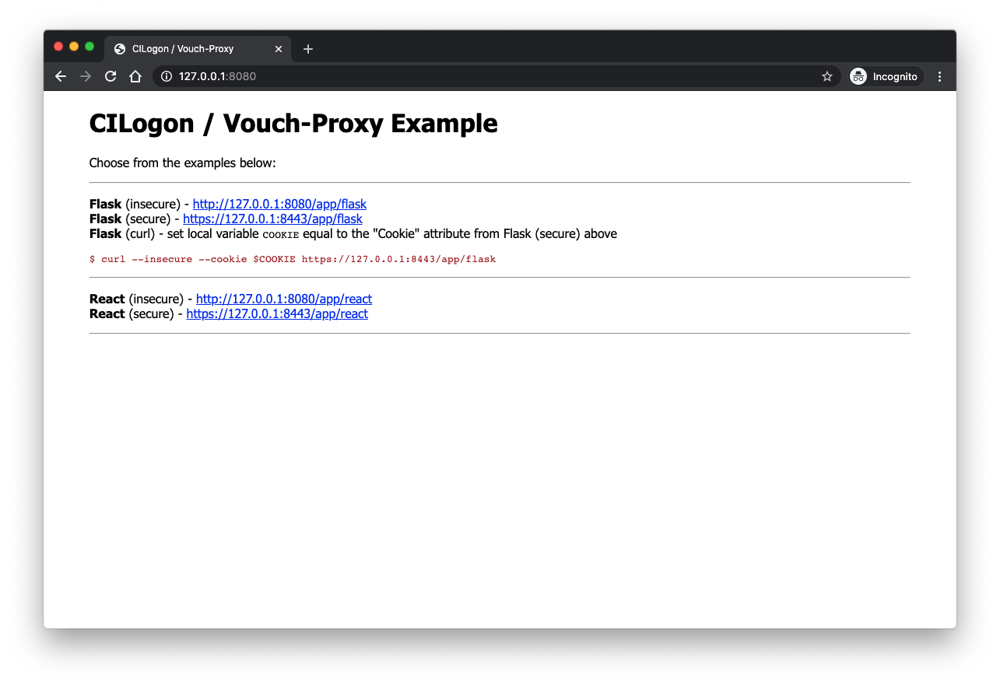
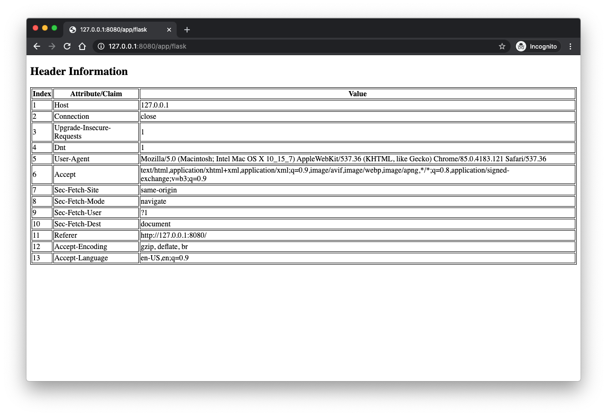
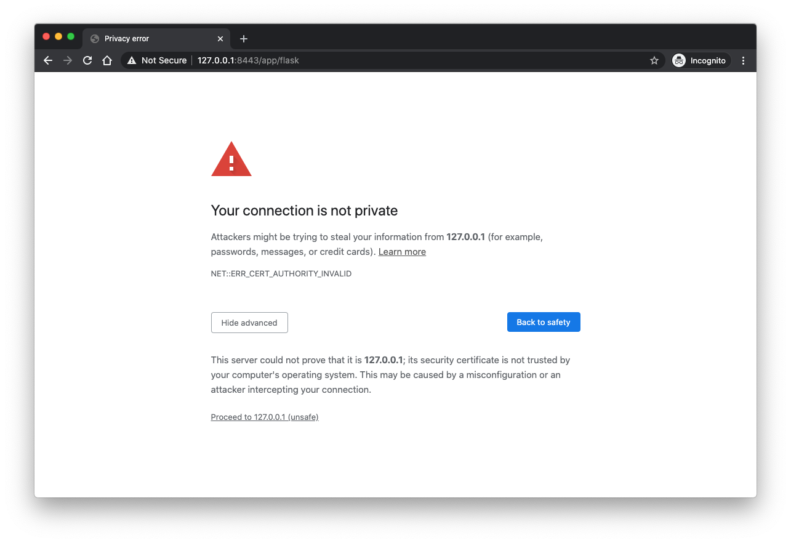
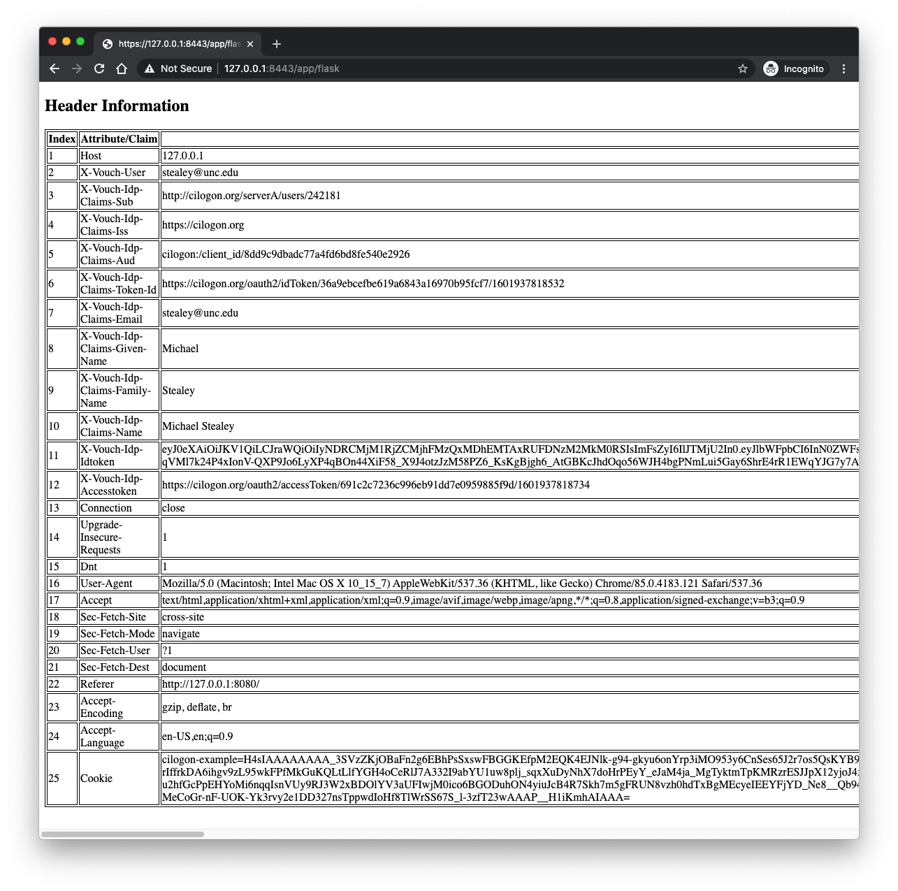
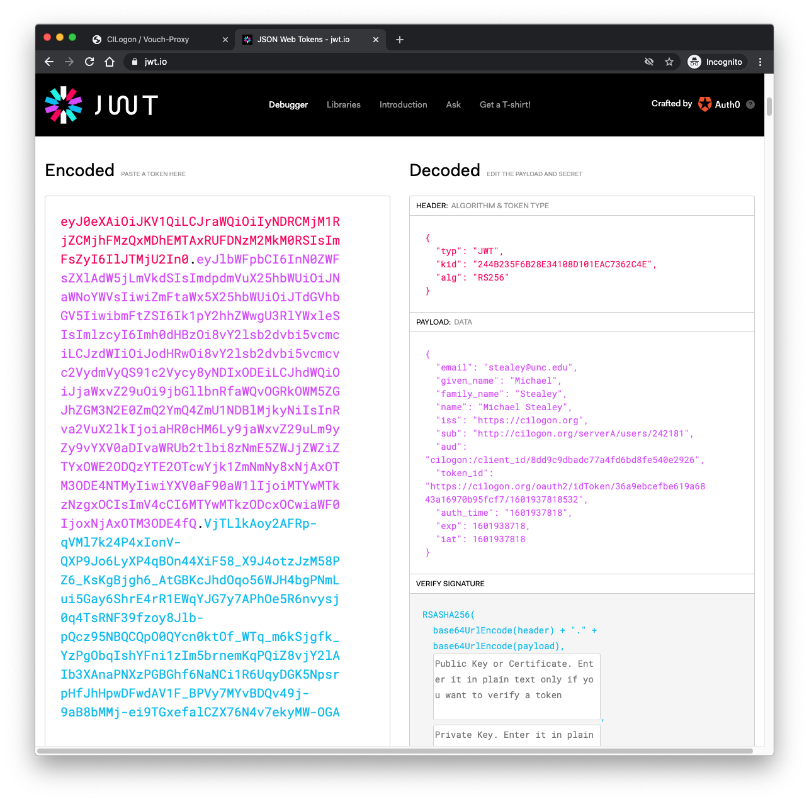
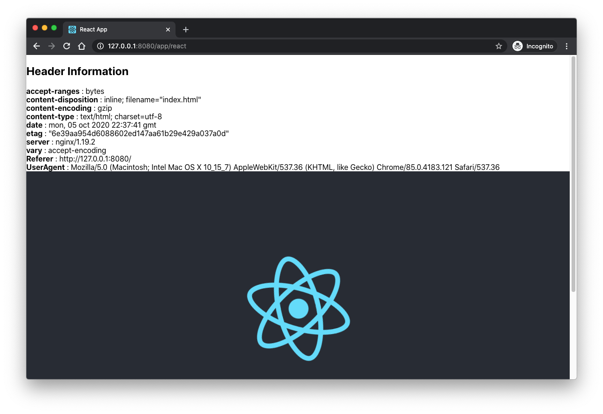
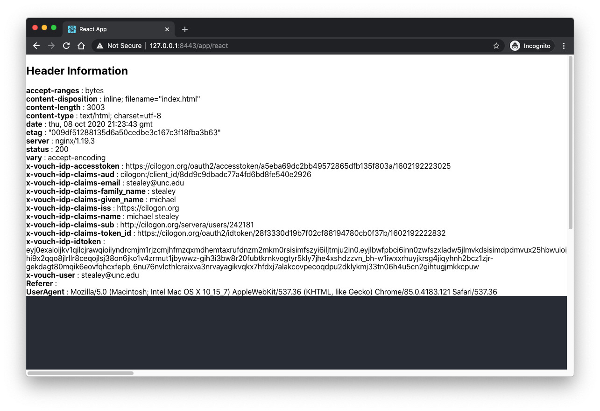

# CILogon / Vouch-Proxy Example

**WORK IN PROGRESS**

- TODO: properly capture headers set by Nginx headers with React

---

This example is designed to demonstrate how to use Vouch-Proxy (with Nginx) to enable authentication using [CILogon's OpenID Connect (OIDC) service](https://www.cilogon.org/oidc) for gaining access to generic web applications.


This project is comprised of two simple applications (Python-Flask and React) using Nginx as the reverse proxy web server to steer traffic using a single URL endpoint, and demonstrating differing behavior depending on the port being used for access.

- **8080**: (insecure) non-authenticated traffic over http
- **8443**: (secure) authenticated traffic over https

Traffic going over port 8080 isn't checked for authentication and is simply allowed to pass onto the Application.

Traffic going over port 8443 is first validated for authentication using Vouch-Proxy, and if validation fails the user is redirected to CILogon to authenticate before being sent back to the chosen application. Traffic on this port will be augmented with a number of header entries prior to being sent to the Application.

- Both application display the header information found in the user's request object. For non-authenticated traffic this is pretty vanilla, for authenticated traffic a number of CILogon attributes (or Claims) have been embedded in the header and displayed back to the user.
- The Flask application also demonstrates how to use the generated "Cookie" to make ReSTful authenticated `curl` calls against the Flask application.

**NOTES**: 

- A self-signed SSL certificate has been included for demonstration purposes and should not be used in any kind of production environment.
- The Flask application is using the default development server (on port 5000) which is sufficient for this demonstration, but should not be used in production.

## About

CILogon enables researchers to log on to cyberinfrastructure (CI). CILogon provides an integrated open source identity and access management platform for research collaborations, combining federated identity management (Shibboleth, InCommon) with collaborative organization management (COmanage). Federated identity management enables researchers to use their home organization identities to access research applications, rather than requiring yet another username and password to log on.

Vouch Proxy is an SSO solution for Nginx using the [auth_request](http://nginx.org/en/docs/http/ngx_http_auth_request_module.html) module that relies on the ability to share a cookie between the Vouch Proxy server and the application it's protecting.

### CILogon scopes

CILogon supports a variety of scopes. This example makes use of the following scopes along with the available claims at each scope:

- **openid**: required
    - resulting claims: 
        - **sub** - a unique identifier for the user, e.g., "`http://cilogon.org/serverA/users/12345`"
        - **iss** - the issuer of the id_token, e.g., "`https://cilogon.org`"
        - **aud** - the audience of the id_token, which is the client_id of the OIDC client, e.g., "`cilogon:/client_id/123456789`"
        - **token_id** - an identifier for the returned id_token, e.g., "`https://cilogon.org/oauth2/idToken/abcdef123456`"
- **email**: optional
    - potential resulting claim: 
        - **email** - an email address, e.g., "`johnsmith@example.edu`"
- **profile**: optional
    - potential resulting claims: 
        - **given_name** - first name, e.g., "`John`"
        - **family_name** - last name, e.g.,  "`Smith`"
        - **name** - display/full name, e.g., "`John A Smith`"

### Additional supported items

In addition to the claims listed above, the following tokens can also be requested during authentication (NOTE: `refresh_token` is only available by request per OIDC Client, and can only be enabled by CILogon staff)

- **tokens**: optional
    - **id_token** - e.g., "`eyJ0eXAiOiJKV1QiLCJhbGciOiJub25lIn0.eyJpZHBfbmFtZSI6IlVuaXZlcnNpdHiOjE0NTQ0NDkxNDEsImF1dGhfdGltZSI6IjE0NTQ0NDkxMTEifQ`"
    - **access_token** - e.g., "`https://cilogon.org/oauth2/accessToken/4871b3cb13982468b4e41f940ffd5d2c1/1451657451704`" 
    - **refresh_token** - e.g., "`https://cilogon.org/oauth2/refreshToken/cc0c63b095269293623bc2a9b18074b/1454449141041`"

## Usage

### Configuration

**Client Registration** 

- To get started, register your client at [https://cilogon.org/oauth2/register](https://cilogon.org/oauth2/register) and wait for notice of approval. Please register your callback URLs on that page with care. They are the only callback URLs that may be used by your client unless you later contact help@cilogon.org and request a change to your registration.
- Upon completion the user will be issued a `CILOGON_CLIENT_ID` and `CILOGON_CLIENT_SECRET`.
- Copy the `vouch/config_template` as `vouch/config` and update that file with the `CILOGON_CLIENT_ID` and `CILOGON_CLIENT_SECRET` information as provided by CILogon.

```yaml
...
oauth:
  # Generic OpenID Connect
  # including okta
  provider: oidc
  client_id: CILOGON_CLIENT_ID           # <-- replace with your client id
  client_secret: CILOGON_CLIENT_SECRET   # <-- replace with your client secret
  auth_url: https://cilogon.org/authorize
  token_url: https://cilogon.org/oauth2/token
  user_info_url: https://cilogon.org/oauth2/userinfo
  scopes:
    - openid
    - email
    - profile
  callback_url: http://127.0.0.1:9090/auth
```

For this example a client was created using the COmanage registry.


### Running

A `docker-compose.yml` file has been included to make running everything on your localhost simple. If you plan to deploy on a machine with a proper domain, you'll need to adjust the configuration files accordingly.

```console
$ docker-compose pull
Pulling nginx       ... done
Pulling flask-app   ... done
Pulling react-app   ... done
Pulling vouch-proxy ... done

$ docker-compose build
nginx uses an image, skipping
vouch-proxy uses an image, skipping
Building flask-app
...
Successfully built bb26e933b5d8
Successfully tagged cilogon-vouch-proxy-example_flask-app:latest
Building react-app
...
Successfully built 6d69d5751de4
Successfully tagged cilogon-vouch-proxy-example_react-app:latest

$ docker-compose up -d
Creating network "cilogon-vouch-proxy-example_default" with the default driver
Creating ex-react-app ... done
Creating ex-vouch     ... done
Creating ex-flask-app ... done
Creating ex-nginx     ... done
```

Check to make sure all containers are running as expected

```console
$ docker-compose ps
    Name                  Command                  State                           Ports
-------------------------------------------------------------------------------------------------------------
ex-flask-app   /docker-entrypoint.sh run_ ...   Up             0.0.0.0:5000->5000/tcp
ex-nginx       /docker-entrypoint.sh ngin ...   Up             0.0.0.0:8443->443/tcp, 0.0.0.0:8080->80/tcp
ex-react-app   /docker-entrypoint.sh run_ ...   Up             0.0.0.0:3000->3000/tcp, 0.0.0.0:5050->5000/tcp
ex-vouch       /vouch-proxy                     Up (healthy)   0.0.0.0:9090->9090/tcp
```

### Example deployment

With all containers running as expected, navigate to [http://127.0.0.1:8080/](http://127.0.0.1:8080/) to view the example options.



**Flask (insecure)**: follow the link to view the basic header information.



Use the back button to return to the example options page.

**Flask (secure)**: If you've previously authenticated you will pass through the vouch-proxy validation directly to the Flask page. Otherwise you'll be redirected to the CILogon Authentication page.

If using the included self-signed SSL certificate you will likely be prompted to accept the risk.



The first time accessing one of the secure examples you will be prompted to authenticate with CILogon. Choose your identity provider from the dropdown list and proceed to authenticate.


Once authenticated, the claims from CILogon are added to the header infromation avaialble to the Flask application.



Use the back button to return to the example options page.

**Flask (curl)**: Using the Vouch-Proxy Cookie, perform an authenticated ReSTful curl call.

In your terminal, set a local variable named `COOKIE` from the contents of the **Cookie** attribute in the returned header information.

```console
$ COOKIE='cilogon-example=H4sIAAAAAAAA_3SVzZKjOBaFn2g...3zfT23wAAAP__H1iKmhAIAAA='
```

Next, curl the secure Flask server and view the returned results (`jq` used to better display the results).

```console
$ curl --insecure --cookie $COOKIE https://127.0.0.1:8443/app/flask | jq .
  % Total    % Received % Xferd  Average Speed   Time    Time     Time  Current
                                 Dload  Upload   Total   Spent    Left  Speed
100  3621  100  3621    0     0  71000      0 --:--:-- --:--:-- --:--:-- 71000
{
  "Accept": "*/*",
  "Connection": "close",
  "Cookie": "cilogon-example=H4sIAAAAAAAA_3SVzZKjOBaFn2g...3zfT23wAAAP__H1iKmhAIAAA=",
  "Host": "127.0.0.1",
  "User-Agent": "curl/7.64.1",
  "X-Vouch-Idp-Accesstoken": "https://cilogon.org/oauth2/accessToken/691c2c7236c996eb91dd7e0959885f9d/1601937818734",
  "X-Vouch-Idp-Claims-Aud": "cilogon:/client_id/8dd9c9dbadc77a4fd6bd8fe540e2926",
  "X-Vouch-Idp-Claims-Email": "stealey@unc.edu",
  "X-Vouch-Idp-Claims-Family-Name": "Stealey",
  "X-Vouch-Idp-Claims-Given-Name": "Michael",
  "X-Vouch-Idp-Claims-Iss": "https://cilogon.org",
  "X-Vouch-Idp-Claims-Name": "Michael Stealey",
  "X-Vouch-Idp-Claims-Sub": "http://cilogon.org/serverA/users/242181",
  "X-Vouch-Idp-Claims-Token-Id": "https://cilogon.org/oauth2/idToken/36a9ebcefbe619a6843a16970b95fcf7/1601937818532",
  "X-Vouch-Idp-Idtoken": "eyJ0eXAiOiJKV1QiLCJraWQiOi...ei9TGxefalCZX76N4v7ekyMW-OGA",
  "X-Vouch-User": "stealey@unc.edu"
}
```

The contents of the `X-Vouch-Idp-Idtoken` is the identity JWT as returned by CILogon, and can be viewed using [https://jwt.io/](https://jwt.io/)



**React (insecure)**: follow the link to view the basic header information.

 

- **NOTE**: the header information being shown in the React section is not accurate at this time and is being investigated.

Use the back button to return to the example options page.

**React (secure)**: If you've previously authenticated you will pass through the vouch-proxy validation directly to the React page. Otherwise you'll be redirected to the CILogon Authentication page.



- **NOTE**: the header information being shown in the React section is not accurate at this time and is being investigated.

## References

- Vouch Proxy: [https://github.com/vouch/vouch-proxy](https://github.com/vouch/vouch-proxy)
- Nginx: [https://hub.docker.com/_/nginx/](https://hub.docker.com/_/nginx/)
- Flask’s documentation: [https://flask.palletsprojects.com/en/1.1.x/](https://flask.palletsprojects.com/en/1.1.x/)
- React's documentation: [https://reactjs.org/docs/getting-started.html](https://reactjs.org/docs/getting-started.html)
- CILogon: [https://www.cilogon.org](https://www.cilogon.org)

