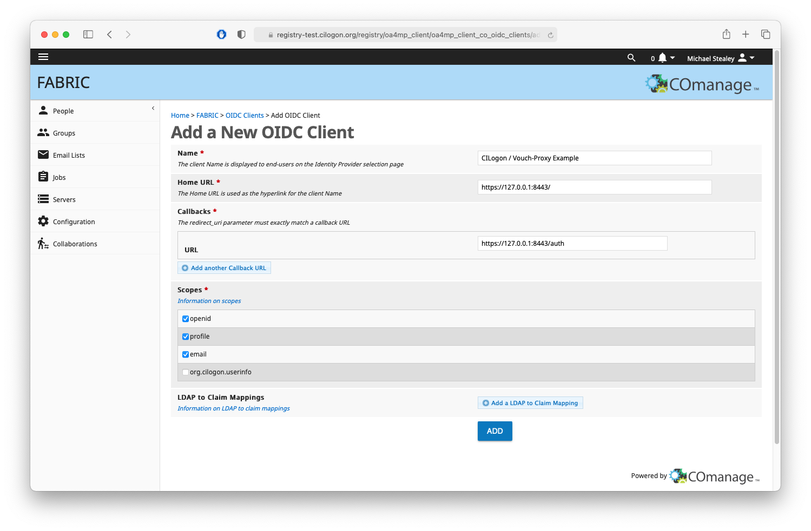
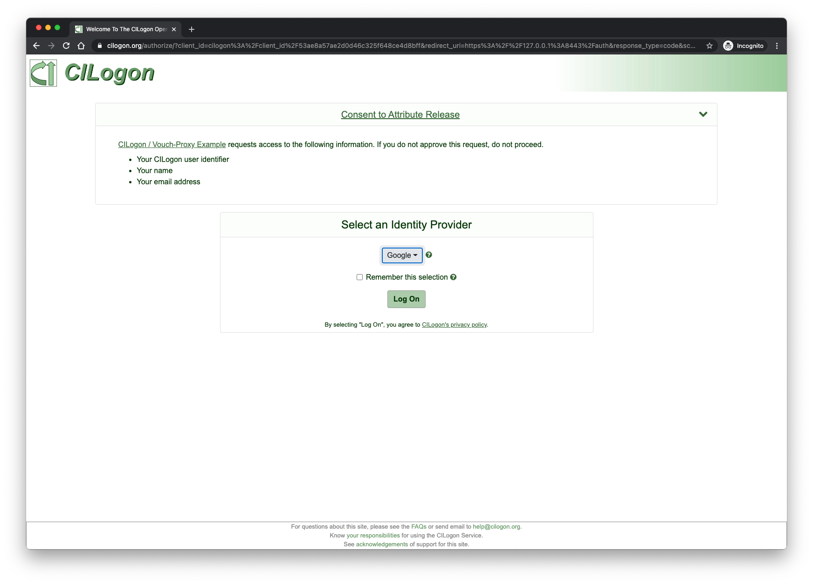

# CILogon / Vouch-Proxy Example

This example is designed to demonstrate how to use Vouch-Proxy (with Nginx) to enable authentication using [CILogon's OpenID Connect (OIDC) service](https://www.cilogon.org/oidc) for establishing authenticated access to generic web applications.


## Table of Contents

- [About](#about) CILogon and Vouch-Proxy
- [Usage](#usage)
    - [Configure](#config) the example code
    - [Run](#run) the example code
- [Navigating the UI](#ui)
    - [Flask app](#flask)
    - [React app](#react)
    - [cURL](#curl)
- [Notes](#notes) regarding configuration for regular domains
- [References](#ref)

## <a name="about"></a>About CILogon and Vouch-Proxy

CILogon enables researchers to log on to cyberinfrastructure (CI). CILogon provides an integrated open source identity and access management platform for research collaborations, combining federated identity management (Shibboleth, InCommon) with collaborative organization management (COmanage). Federated identity management enables researchers to use their home organization identities to access research applications, rather than requiring yet another username and password to log on.

Vouch Proxy is an SSO solution for Nginx using the [auth_request](http://nginx.org/en/docs/http/ngx_http_auth_request_module.html) module that relies on the ability to share a cookie between the Vouch Proxy server and the application its protecting.

### CILogon scopes

CILogon supports a variety of scopes. This example makes use of the following scopes along with the available claims at each scope:

- **openid**: required
    - resulting claims: 
        - **sub** - a unique identifier for the user, e.g., "`http://cilogon.org/serverA/users/12345`"
        - **iss** - the issuer of the id_token, e.g., "`https://cilogon.org`"
        - **aud** - the audience of the id_token, which is the client_id of the OIDC client, e.g., "`cilogon:/client_id/123456789`"
        - **token_id** - an identifier for the returned id_token, e.g., "`https://cilogon.org/oauth2/idToken/abcdef123456`"
- **email**: optional
    - potential resulting claim: 
        - **email** - an email address, e.g., "`johnsmith@example.edu`"
- **profile**: optional
    - potential resulting claims: 
        - **given_name** - first name, e.g., "`John`"
        - **family_name** - last name, e.g.,  "`Smith`"
        - **name** - display/full name, e.g., "`John A Smith`"

### Additional supported items

In addition to the claims listed above, the following tokens can also be requested during authentication (NOTE: `refresh_token` is only available by request per OIDC Client, and can only be enabled by CILogon staff)

- **tokens**: optional
    - **id_token** - e.g., "`eyJ0eXAiOiJKV1QiLCJhbGciOiJub25lIn0.eyJpZHBfbmFtZSI6IlVuaXZlcnNpdHiOjE0NTQ0NDkxNDEsImF1dGhfdGltZSI6IjE0NTQ0NDkxMTEifQ`"
    - **access_token** - e.g., "`https://cilogon.org/oauth2/accessToken/4871b3cb13982468b4e41f940ffd5d2c1/1451657451704`" 
    - **refresh_token** - e.g., "`https://cilogon.org/oauth2/refreshToken/cc0c63b095269293623bc2a9b18074b/1454449141041`"

## <a name="usage"></a>Usage

Since this is an example it will be running at [https://127.0.0.1:8443]() which is a **localhost** address and not something you'd generally register an OIDC client for. But for sake of this example we are registering it as such.

### <a name="config"></a>Configure the example code

**Client Registration** 

- To get started, register your client at [https://cilogon.org/oauth2/register](https://cilogon.org/oauth2/register) and wait for notice of approval. Please register your callback URLs on that page with care. They are the only callback URLs that may be used by your client unless you later contact help@cilogon.org and request a change to your registration.
- Upon completion the user will be issued a `CILOGON_CLIENT_ID` and `CILOGON_CLIENT_SECRET`.
- Copy the `vouch/config_template` as `vouch/config` and update that file with the `CILOGON_CLIENT_ID` and `CILOGON_CLIENT_SECRET` information as provided by CILogon.

```yaml
...
oauth:
  # Generic OpenID Connect
  # including okta
  provider: oidc
  client_id: CILOGON_CLIENT_ID           # <-- replace with your client id
  client_secret: CILOGON_CLIENT_SECRET   # <-- replace with your client secret
  auth_url: https://cilogon.org/authorize
  token_url: https://cilogon.org/oauth2/token
  user_info_url: https://cilogon.org/oauth2/userinfo
  scopes:
    - openid
    - email
    - profile
  callback_url: http://127.0.0.1:8443/auth
```

For this example a client was created using the COmanage registry directly. Ensure the **Callback URL** and **Scopes** match the `vouch/config` configuration file. Mismatches in definition between the OIDC Client, Vouch configuration or Nginx server definitions can cause failures to occur.



Upon registration a **Client ID** and **Client Secret** will be given to the user.


### <a name="run"></a>Run the example code

A `docker-compose.yml` file has been included to make running everything on your localhost simple. If you plan to deploy on a machine with a proper domain, you'll need to adjust the configuration files accordingly.

```console
$ docker-compose pull
Pulling nginx       ... done
Pulling flask-app   ... done
Pulling react-app   ... done
Pulling vouch-proxy ... done

$ docker-compose build
nginx uses an image, skipping
vouch-proxy uses an image, skipping
Building flask-app
...
Successfully built bb26e933b5d8
Successfully tagged cilogon-vouch-proxy-example_flask-app:latest
Building react-app
...
Successfully built 6d69d5751de4
Successfully tagged cilogon-vouch-proxy-example_react-app:latest

$ docker-compose up -d
Creating network "cilogon-vouch-proxy-example_default" with the default driver
Creating ex-react-app ... done
Creating ex-vouch     ... done
Creating ex-flask-app ... done
Creating ex-nginx     ... done
```

Check to make sure all containers are running as expected

```console
$ docker-compose ps
    Name                  Command                  State                          Ports
----------------------------------------------------------------------------------------------------------
ex-flask-app   /docker-entrypoint.sh run_ ...   Up             5000/tcp
ex-nginx       /docker-entrypoint.sh ngin ...   Up             0.0.0.0:8443->443/tcp, 0.0.0.0:8080->80/tcp
ex-react-app   /docker-entrypoint.sh run_ ...   Up             3000/tcp, 5000/tcp
ex-vouch       /vouch-proxy                     Up (healthy)   9090/tcp
```

Notice that by default only ports 8080 and 8443 are exposed to the outside world. All other container-to-container interaction takes place within the private docker subnet named `cilogon-vouch-proxy-example_default`. If you wish to expose the other container ports to the external host network, simply uncomment the port definitions in the **docker-compose.yml** file.

## <a name="ui"></a>Navigating the UI

Navigate your browser to [https://127.0.0.1:8080](), Nginx is configured to automatically redirect your browser to the secure version running at [https://127.0.0.1:8443]()

Since the example is using self-signed certificates most browsers will warn you prior to allowing you to view the site. Accept and proceed to the site.


Once the self-signed certificates have been accepted you will see the main page which defines three possible examples to interact with. The main index.html page is served directly from the `ex-nginx` container.

- Flask app
- React app
- cURL interaction


## <a name="flask"></a>Flask app

Choosing the Flask app will redirect your browser to the container running the Flask application at slug `/app/flask`. Behind the scenes Nginx is now proxying your web traffic to port 5000 of the `ex-flask-app` container.

By default you are not authenticated, and should see the request headers associated with non-authenticated traffic.


Clicking the **Login** button will redirect you from the `ex-flask-app` container to the `ex-vouch` container's **login** endpoint. This is where the CILogon OIDC client settings are detected which then redirect you to the OIDC client at [cilogon.org]()



Choose your identity provider from the dropdown list. In this example I've chosen to use UNC Chapel Hill as my identity provider.


Upon successful authentication the user is redirected back to the `/app/flask` slug, but this time the headers are set with the authentication information (OIDC Claims) as returned by CILogon.


Choosing the [Homepage]() link at the bottom left will send the user back to the main index.html page.

## <a name="react"></a>React app

Choosing the React app will redirect your browser to the container running the React application at slug `/app/react`. Behind the scenes Nginx is now proxying your web traffic to port 5000 of the `ex-react-app` container.

By default you are not authenticated, and should see the request headers associated with non-authenticated traffic.


Clicking the **Login** button will redirect you from the `ex-react-app` container to the `ex-vouch` container's **login** endpoint. This is where the CILogon OIDC client settings are detected which then redirect you to the OIDC client at [cilogon.org]()


Choose your identity provider from the dropdown list. In this example I've chosen to use UNC Chapel Hill as my identity provider.


Upon successful authentication the user is redirected back to the `/app/react` slug, but this time the headers are set with the authentication information (OIDC Claims) as returned by CILogon.


Choosing the [Homepage]() link at the bottom left will send the user back to the main index.html page.

## <a name="curl"></a>cURL

You should have noticed a Cookie being set after you've logged in using one of the above examples. Copy the Cookie to your clipboard before continuing to the next steps.

Export your Cookie:

```console
$ export COOKIE='cilogon-example=H4sIAAAAAAAA_...__i8No1BEIAAA='
```

Make a non-authenticated curl call (no cookie):

```console
$ curl -s --insecure https://127.0.0.1:8443/app/flask | jq .
{
  "Accept": "*/*",
  "Connection": "close",
  "Host": "127.0.0.1",
  "User-Agent": "curl/7.64.1"
}
```

Make an authenticated curl call (use cookie):

```console
$ curl -s --insecure --cookie $COOKIE https://127.0.0.1:8443/app/flask | jq .
{
  "Accept": "*/*",
  "Connection": "close",
  "Cookie": "cilogon-example=H4sIAAAAAAAA_...__i8No1BEIAAA=",
  "Host": "127.0.0.1",
  "User-Agent": "curl/7.64.1",
  "X-Vouch-Idp-Accesstoken": "https://cilogon.org/oauth2/accessToken/17cbe2601088f2465e85d5354966496/1606672439132",
  "X-Vouch-Idp-Claims-Aud": "cilogon:/client_id/53ae8a57ae2d0d46c325f648ce4d8bff",
  "X-Vouch-Idp-Claims-Email": "stealey@unc.edu",
  "X-Vouch-Idp-Claims-Family-Name": "Stealey",
  "X-Vouch-Idp-Claims-Given-Name": "Michael",
  "X-Vouch-Idp-Claims-Iss": "https://cilogon.org",
  "X-Vouch-Idp-Claims-Name": "Michael Stealey",
  "X-Vouch-Idp-Claims-Sub": "http://cilogon.org/serverA/users/242181",
  "X-Vouch-Idp-Claims-Token-Id": "https://cilogon.org/oauth2/idToken/57996cccc190cfbffd4bcf950e1073a0/1606672438949",
  "X-Vouch-Idp-Idtoken": "eyJ0eXAiOiJKV1QiLCJ...QQI-5Bcb1G8uYSdJkCjB47MFIZQ",
  "X-Vouch-User": "stealey@unc.edu"
}
```

View contents of `X-Vouch-Idp-Idtoken` using [https://jwt.io/](https://jwt.io/)


## <a name="notes"></a>Notes regarding configuration for regular domains

When setting up vouch-proxy / nginx in a real environment it's important to have your FQDN or IP information already known and ready to use.

### Define the OIDC Client

CILogon will require the following information:

- **Name**: The client Name is displayed to end-users on the Identity Provider selection page
- **Home URL**: The Home URL is used as the hyperlink for the client Name
- **Callbacks**: The redirect_uri parameter must exactly match a callback URL
- **Scopes**: [Information on Scopes](https://www.cilogon.org/oidc), one or more of {`openid`, `profile`, `email`, `org.cilogon.userinfo`}

### Configuration: `vouch/config`

Some important configuration options to keep in mind:

- **vouch.post\_logout\_redirect\_uris**: in order to prevent redirection attacks all redirected URLs to `/logout` must be specified the URL must still be passed to Vouch Proxy as [https://vouch.yourdomain.com/logout?url=${ONE OF THE URLS LISTED}]()
- **cookie.domain**: domain the cookie is attributed to
- **cookie.name**: name of cookie being generated
- **oauth.client_id**: must match the `CLIENT_ID` as provided by CILogon
- **oauth.client_secret**: must match the `CLIENT_SECRET` as provided by CILogon
- **oauth.callback_url**: must match one of the **Callbacks** as listed in OIDC client at CILogon

### Configuration: `nginx/default.conf`

Nginx can be used to reverse proxy most any URL slug to most any application it has access to. It is important to properly map incoming requests to the appropriate proxied service.

Nginx server blocks are evaluated in order, so ensure the flow of your `default.conf` file is organized in such a way that all of your valid URL slugs can be properly discovered.

Some important configuration options to keep in mind:

- **Callbacks**: the OIDC client at CILogon will expect to find an exact match for one of it's listed Callbacks when interacting with your application. It is important to proxy this correctly if using Nginx as a reverse proxy for the vouch-proxy docker container (Example below)

    ```conf
    location /auth {
        # redirect to Vouch Proxy for authentication with OIDC client
        proxy_pass http://vouch-proxy:9090/auth;
    }
    ```
- **logout redirects**: logout redirect URLs must be present in the list specified in `vouch/config` under the **vouch.post\_logout\_redirect\_uris** section (Example below)

    ```conf
    location /logout/flask {
        # redirect to Vouch Proxy for login
        proxy_pass http://vouch-proxy:9090/logout?url=$scheme://$http_host/app/flask;
    }
    ```

## <a name="ref"></a>References

- Vouch Proxy: [https://github.com/vouch/vouch-proxy](https://github.com/vouch/vouch-proxy)
- Nginx: [https://hub.docker.com/_/nginx/](https://hub.docker.com/_/nginx/)
- Flask’s documentation: [https://flask.palletsprojects.com/en/1.1.x/](https://flask.palletsprojects.com/en/1.1.x/)
- React's documentation: [https://reactjs.org/docs/getting-started.html](https://reactjs.org/docs/getting-started.html)
- CILogon: [https://www.cilogon.org](https://www.cilogon.org)

